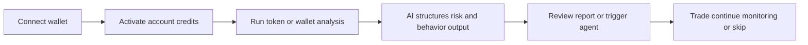

  

<h1 align="center">Auralys</h1>

  
<strong>Auralys is an AI-powered trading and on-chain analytics platform that combines a terminal, token and wallet analysis, and agent-based automation into a single decision-making system</strong>

  

    Trading terminal • Token analytics • Wallet analytics • AI agents • Credits powered by $AURA
  

  <a href="#overview">Overview</a>
  ·
  <a href="#what-it-does">What It Does</a>
  ·
  <a href="#show-it">Show It</a>
  ·
  <a href="#try-it">Try It</a>
  ·
  <a href="#how-it-works">How It Works</a>
  ·
  <a href="#risk-notice">Risk Notice</a>

---

## Quick Links

---

## Overview

> [!IMPORTANT]
> Auralys is an AI-native on-chain platform built for people who actually trade, analyze, and automate — not just watch charts

Auralys combines a live trading terminal, structured token and wallet analytics, and configurable AI agents under one account and one credit system

> [!TIP]
> The product is built around one loop: discover opportunities, inspect structure, decide faster, and act from the same environment

### Product Map

| Surface | What it is | Main use |
|---|---|---|
| Trading Terminal | Real-time market interface | Scan, evaluate, execute |
| Token Analytics | Structured AI token report | Check risk before entry |
| Wallet Analytics | Wallet behavior and allocation analysis | Profile wallets and compare structure |
| Agents | Configurable AI-driven automation objects | Monitor, analyze, recommend |
| Credits & $AURA | Usage and billing layer | Power actions across the platform |
| API | JSON HTTP developer surface | Integrate analytics and agents |

---

## What It Does

> [!NOTE]
> Auralys is not a collection of disconnected tools — each surface feeds the next one

With Auralys, users can:

- trade from a real-time terminal
- run AI-powered token analytics with structured risk output
- inspect wallets through allocation, concentration, and behavior models
- create agents that monitor, analyze, and recommend under explicit limits
- manage all product usage through credits tied to the same account

### Core Capabilities

| Capability | What user gets |
|---|---|
| Token Analytics | Risk score, liquidity view, holder structure, security context |
| Wallet Analytics | Profile label, allocation breakdown, concentration metrics, structural flags |
| AI Agents | Monitoring, scheduled analysis, recommendation flows |
| Credits System | Clear limits, billing visibility, reusable usage model |
| Burn Dashboard | Transparent view of $AURA usage, burn, and treasury routing |

> [!CAUTION]
> Agents help systematize workflows, but they do not replace judgment, responsibility, or risk management

---

## Show It

> [!TIP]
> The interface is designed so the user can move from raw market attention to structured action without leaving the product

### Main Surfaces

| Area | What you see |
|---|---|
| Terminal | Token lists, price context, liquidity view, execution flow |
| Token Report | Summary, score, risk band, supply, holders, security, interpretation |
| Wallet Report | Wallet type, behavior summary, allocation buckets, structural risk |
| Agents Panel | Agent list, status, targets, recent activity, credit usage |
| Burn Dashboard | Total burn, treasury flow, activity breakdown, personal footprint |

### Example User Path

| Step | Action | Result |
|---|---|---|
| 1 | Open token in terminal | Quick market context |
| 2 | Run token analysis | Structured AI risk report |
| 3 | Check wallet activity | Understand who is holding or moving |
| 4 | Create agent | Monitor similar conditions automatically |
| 5 | Continue with trade or skip | Decision made with more context |

> [!IMPORTANT]
> This README shows the core logic only. Full screenshots, schemas, and detailed references belong in the docs

---

## Try It

> [!IMPORTANT]
> Auralys is designed to be usable in a few steps without long setup friction

### Quick Start

1. Connect your wallet
2. Pick your primary wallet for trading and analytics
3. Receive or top up credits under your account
4. Run your first token or wallet analysis
5. Continue into terminal flow or create an agent

### Getting Started Paths

| Goal | Best place to start |
|---|---|
| I want to trade now | Terminal |
| I want to inspect a token first | Token Analytics |
| I want to study a wallet | Wallet Analytics |
| I want automation | Agents |
| I want to integrate from code | API |

> [!NOTE]
> Credits belong to your Auralys account, not to a single wallet, which makes switching between workflows cleaner

---

## How It Works

> [!TIP]
> Under the hood, Auralys follows a simple flow from data to action

### Under the Hood

| Layer | Role |
|---|---|
| Data Sources | On-chain activity, wallet states, token structure, market context |
| Processing Logic | Scoring, classification, risk interpretation, task execution |
| Core Modules | Terminal, token analytics, wallet analytics, agents, credits |
| Output | Structured reports, alerts, recommendations, account usage visibility |
| Interface | Web app, Telegram surface, API endpoints |

---

## Risk Notice

> [!WARNING]
> Auralys provides analytics, structure, and automation tooling — not guaranteed outcomes

- not financial advice
- outputs may be delayed, incomplete, or wrong
- crypto markets are high risk
- all decisions and transactions remain the user’s responsibility

> [!CAUTION]
> Auralys is non-custodial. The platform does not store private keys and cannot move funds without explicit user approval
